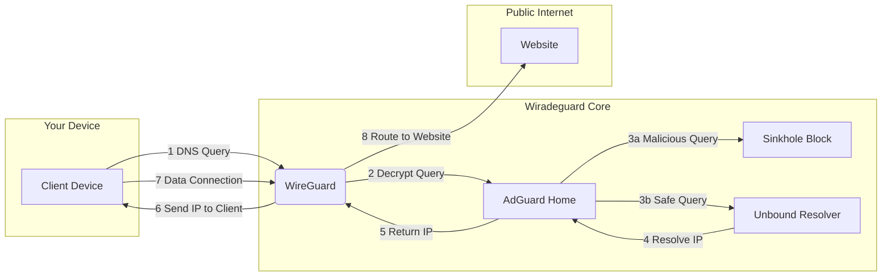
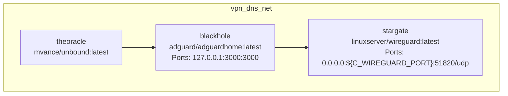
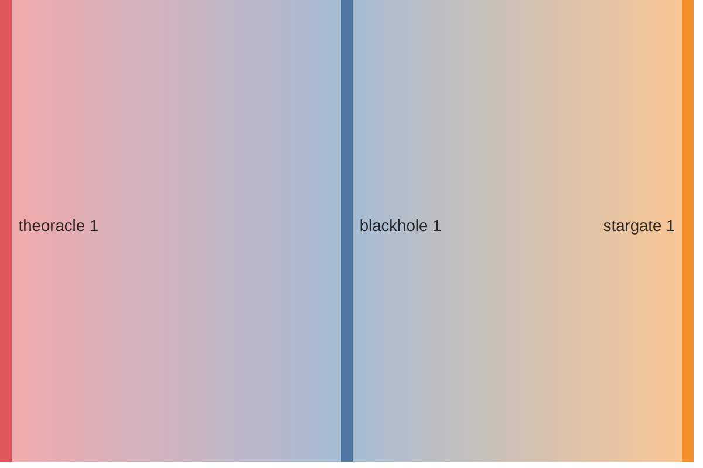
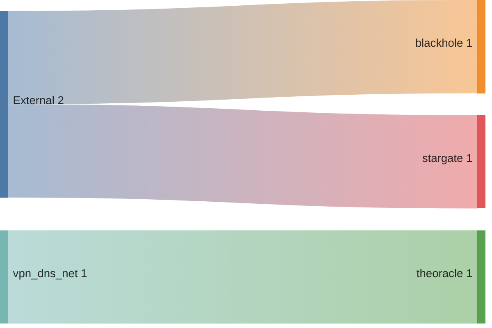
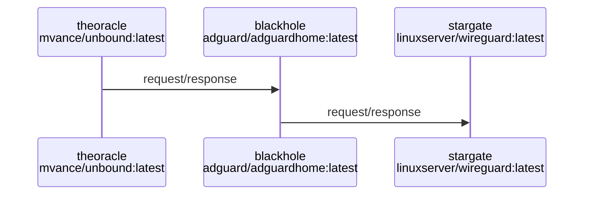

# Wiradeguard: your self-hosted dns sinkhole & privacy core

This project provides the blueprints to forge your own hardened network core. The goal is to achieve **digital sovereignty** by aggressively filtering network traffic and eliminating data exfiltration at its source. You will build a system that you own and control, making your network actively hostile to advertisers, trackers, and malicious actors.

The stack is composed of three key layers:

  * **Encrypted transport (`WireGuard`)**: A high-speed, kernel-level VPN that acts as a secure, encrypted transport layer. All traffic from your devices is forced through this tunnel, preventing any local network or ISP-level snooping.

  * **DNS sinkhole (`AdGuard Home`)**: The filtering engine and traffic controller. It intercepts all DNS queries and cross-references them against curated blocklists. Requests to advertising, malware, or tracking domains are **black-holed** sent to a null route, effectively ceasing to exist from your devices' perspective.

  * **Recursive resolver (`Unbound`)**: A zero-knowledge DNS resolver that you control. Instead of forwarding your Browse habits to a third-party service (like Google's `8.8.8.8`), Unbound performs **recursive lookups** itself, querying the internet's root DNS servers directly. This ensures your DNS history remains private.

-----

## Architecture: the data flow

The architecture is designed as a strict, sequential pipeline. Data must pass through each layer of inspection before it's allowed to reach the public internet.



-----

## Understanding your DNS choices

To understand why this project is built this way, it's crucial to know who can see your Browse history in different setups.

### **Scenario 1: The default internet**

When you don't use a VPN, your Internet Service Provider (ISP) handles your DNS requests.

  * **What happens:** Your ISP sees every website you visit and can log this history. This data can be monetized or shared.

### **Scenario 2: Using a VPN with a public DNS (e.g., Cloudflare)**

This common setup involves routing your traffic through a WireGuard server, which then asks a public resolver like Cloudflare or Google for DNS records.

  * **What happens:**
    1.  Your **home ISP** is blinded. They only see encrypted traffic going to your server.
    2.  Your server then forwards your DNS query (e.g., "what is the IP for `site.com`?") to Cloudflare.
  * **The privacy issue:** You've simply shifted trust. Now, your **server's ISP** can see your server asking Cloudflare for information, and **Cloudflare** itself can log your entire Browse history.

### **Scenario 3: The Wiradeguard way (full privacy with Unbound)**

This project uses Unbound as your own private resolver, which is the key to maximizing privacy.

  * **What happens:**
    1.  Your **home ISP** is blinded, same as before.
    2.  Your server's AdGuard Home passes the DNS query to your **own Unbound resolver**.
    3.  Unbound does **not** forward the question to a single company. Instead, it communicates directly with the internet's authoritative root servers to find the answer itself.
  * **The privacy benefit:** What your server's ISP sees is completely different. Instead of a neat stream of requests to a single company like Cloudflare, they see scattered, low-level DNS chatter to many different high-level servers across the internet. This pattern is much harder to track and doesn't create a clean log of your Browse habits for any single entity.

### **Summary: Who sees your history?**

| Setup | Your Home ISP | Your Server's ISP | Third-Party DNS (Cloudflare) |
| :--- | :--- | :--- | :--- |
| **Default Internet** | ✅ Yes | (not applicable) | (if used) |
| **VPN + Public DNS** | ❌ No | ✅ Yes | ✅ Yes |
| **Wiradeguard (VPN + Unbound)**| ❌ No | (only scattered traffic) | ❌ No |

This project defaults to Scenario 3 because it prevents any single company from easily logging your entire digital life.

-----

## Deployment

### Prerequisites

  * A Linux host (VPS or local machine) with root/sudo access.
  * **Docker** and **Docker Compose** installed.
  * `git` and `wget` installed.

### Step 1: initial configuration

Clone the repository and instantiate your local environment file.

```bash
git clone https://github.com/opensecurity/wiradeguard
cd wiradeguard
cp .env-example .env
```

Next, **edit the `.env` file**. Set your `C_TZ` (timezone), the number of WireGuard peers (`C_WIREGUARD_PEERS`), and the external VPN port (`C_WIREGUARD_PORT`).

### Step 2: system preparation & deployment

The `Makefile` automates the setup. First, prime the system by fetching the root hints file required by Unbound. Then, launch the stack.

```bash
# Fetch the root hints file for unbound
make get-root-hints

# (Optional but recommended) Apply kernel performance tuning
make tune-host

# Build and launch the full stack in detached mode
make up
```

This command will pull the required images, build the containers, and generate your WireGuard client configurations in the `./wireguard/conf/` directory.

### Step 3: finalizing the dns sinkhole

This crucial one-time step directs AdGuard Home to use your private Unbound resolver instead of a public one.

1.  Navigate to your AdGuard Home console at `http://<your_server_ip>:3000`.
2.  Complete the initial setup wizard to create your admin account.
3.  Go to **Settings -\> DNS settings**.
4.  Under **Upstream DNS servers**, delete any default entries and add **only** your Unbound container:
    ```
    theoracle:53
    ```
5.  Under **Private reverse DNS servers**, add the same entry:
    ```
    theoracle:53
    ```
6.  Click **Apply**. Your DNS resolution is now fully self-contained.

### Step 4: connecting clients

Import a generated `.conf` file from `./wireguard/conf/` into your WireGuard client on your phone, laptop, or other devices. Once connected, all your traffic is being filtered through your Wiradeguard core.

-----

## Operations

All stack management is handled via the `Makefile`:

  * `make up`: Deploys and starts the entire stack.
  * `make down`: Shuts down the stack and destroys its data volumes.
  * `make logs`: Tails the aggregated logs from all running services in real-time.
  * `make restart`: Performs a clean restart of all services.

<!-- DOCKUMENTOR START -->

### 🐳 Service: theoracle
- **Image**: mvance/unbound:latest
- **Ports**: 
- **Volumes**: ./unbound/:/opt/unbound/etc/unbound/
- **Depends On**: 
- **Command**: No command specified
#### Environment Variables

| Variable | Value |
|----------|-------|

### 🐳 Service: blackhole
- **Image**: adguard/adguardhome:latest
- **Ports**: 127.0.0.1:3000:3000
- **Volumes**: adguard_work:/opt/adguardhome/work, ./adguard/conf:/opt/adguardhome/conf
- **Depends On**: theoracle
- **Command**: No command specified
#### Environment Variables

| Variable | Value |
|----------|-------|

### 🐳 Service: stargate
- **Image**: linuxserver/wireguard:latest
- **Ports**: 0.0.0.0:${C_WIREGUARD_PORT}:51820/udp
- **Volumes**: ./wireguard/conf:/config, /lib/modules:/lib/modules:ro
- **Depends On**: blackhole
- **Command**: No command specified
#### Environment Variables

| Variable | Value |
|----------|-------|
| PUID | ${C_PUID} |
| PGID | ${C_PGID} |
| TZ | ${C_TZ} |
| PEERS | ${C_WIREGUARD_PEERS} |
| PEERDNS | 10.13.37.10 |
| INTERNAL_SUBNET | 10.42.42.0/24 |
| ALLOWEDIPS | 0.0.0.0/0 |


## Networks


### Network: vpn_dns_net


## Graphs

### Network depend


### Services depend


### Services ports


## Service Interaction Sequence Diagram



## Example Commands

- **Start Services**: `docker compose up -d`
- **Stop Services**: `docker compose down`
- **View Logs for a Service**: `docker compose logs [service]`

## Troubleshooting


- Ensure Docker is running before starting services.

- Check container logs if a service fails to start.

- Verify network connections if services can't communicate.


## Maintenance Tips


- To update a service, modify the image tag and run `docker-compose up -d`.

- Review and apply environment variable changes without rebuilding containers.

<!-- DOCKUMENTOR END -->